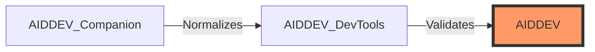

# 🛠️ AIDDEV & Ascension API Docs
=======
# WORK IN PROGRESS!!!

# AIDDEV
Ascension Integrated Developer Environment (In‑Game)

---

## 👋 Introduction: The "Bob" Backstory

Hi, my name is **Bob**.

After quitting retail WoW years ago, I eventually found my way to **Project Ascension**. I play casually, but I quickly ran into a major problem: **The UI.** I play on a massive TV, and standard addons like Weakauras and ElvUI often come with tiny, inconsistent fonts. I got tired of squinting, so I decided to look under the hood.

> [!IMPORTANT]
> **I am not a coder.** I am "lazy by nature" when it comes to boring work, so I recruited an AI assistant (ChatGPT) to do the heavy lifting. This project is the result of me trying to fix my own "Big TV" problems and realizing the Ascension API needed better documentation.

### 🤝 Shout Outs
A big `/wave` to **Xurkon**. We met on Discord, and he showed me his massive upcoming project. He's the reason I have no spare time left now!
👉 **Check him out:** [Xurkon on GitHub](https://github.com)

---

# 💻 AIDDEV (In-Game IDE)
**Ascension Integrated Developer Environment**

AIDDEV is the in-game IDE for Ascension addon developers. It provides a unified interface for **static analysis**, **runtime diagnostics**, and **developer tooling** inside the WoW client.

### 🏗️ The Ecosystem
AIDDEV is the **consumer layer** of a three-part toolchain. It does not load files directly from disk; it only consumes validated data.

### ✨ Key Features
*   **🔍 Static Analysis:** Project browser, AST-based handler inference, and ruleset-driven diagnostics.
*   **⚡ Runtime Diagnostics:** Live function call tracking, argument pattern analysis, and a **Snapshot System** for diffing session data.
*   **🛡️ DevTools Integration:** Integrated "Run DevTools" button for pre-flight validation (Syntax, Encoding, Line Endings).
*   **📊 Environment Banner:** Real-time metadata for Realm, Ruleset, Client build, and Encoding.

---

## 🕹️ How to Use

### Commands
| Command | Action |
| :--- | :--- |
| `/aiddev` | Opens the main IDE interface |
| `/aiddevlive` | Toggles the Live Monitor window |

### Workflow
1.  **Static Analysis:** Inspect source code and static expectations.
2.  **Runtime Diagnostics:** Capture snapshots before/after gameplay to validate deterministic behavior.

---

## 📂 About the Documentation Scans

The documentation files included here are scans I ran to figure out the Ascension API, "beautified" by ChatGPT.

> [!WARNING]
> **User Judgement Required:**
> Remember: *Shit in, shit out.* Since I don't code, I let the AI process these. Use your own judgment when using these documentations.

---

## 📋 Requirements
- [ ] **AIDDEV_Companion** (Provides project files)
- [ ] **AIDDEV_DevTools** (Validation layer)
- [ ] **Ascension Client**

---
*Created by Bob — Powered by ChatGPT, Coffee, and the Ascension Community.*
